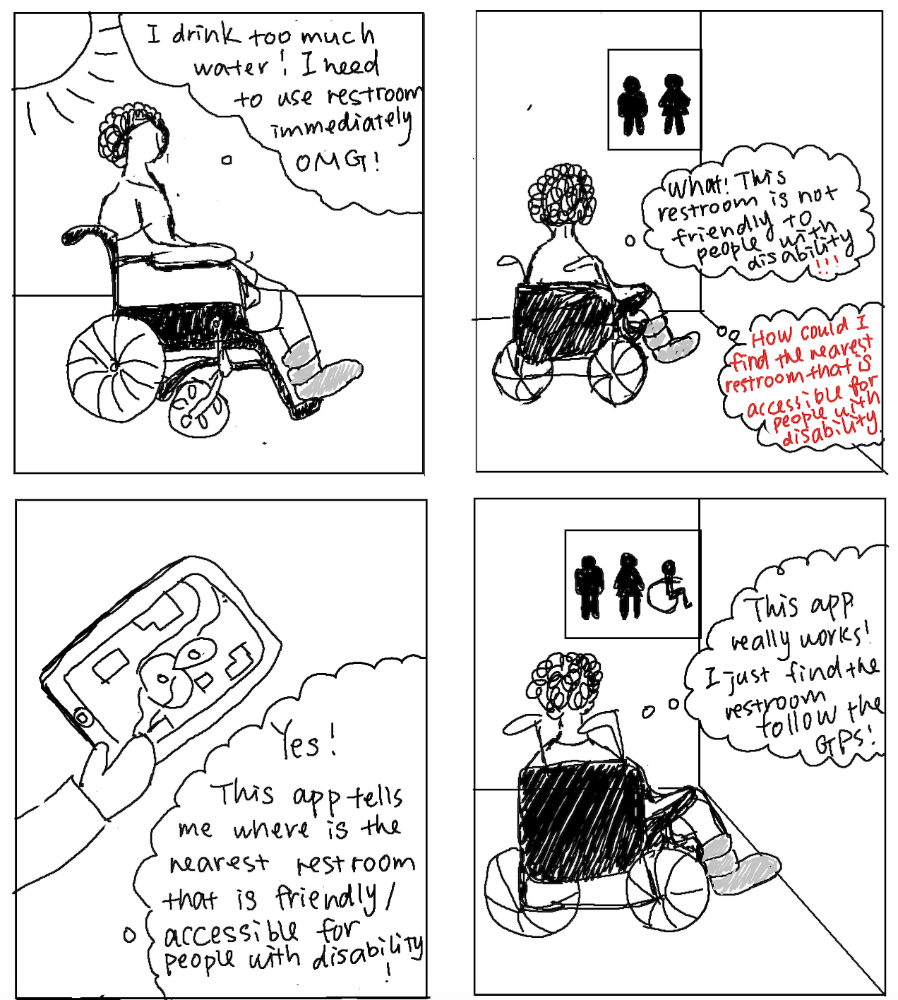

# COGS 121 Team ZZZZ milestone 1

## Team Members:
  Wei Zeng  
  Qianzi Li  
  Xinyi Jiao  
  Siyu Zhou

## Project Proposal:
  Hi, we are team "ZZZZ". This quarter, we are designing for the people with
  disabilities.
  Introducing our web-app "#TBD#", a platform for people with disabilities to seek help with daily matters.  
  How does "#TBD#" works? #TBD# is not only a platform to seek help, we are making it a platform to provide help as well. People with disabilities could submit a request to our platform while the volunteers could accept the tickets.

## Why #TBD# fits the project theme?
  We believe that this is a meaningful and helpful platform that our target population **NEEDS**. From our friends experiences, there's always some moments that people with disabilities need helps from others. However, it isn't always easy to ask for help. "TBD" provides a fast, safe and convenient platform for people with disabilities to solve there needs. In addition, none of our team members fall into the target population.

## Possible API that we could use:
  We plan to use the Google Map API so that we can access the location info and use the distance matrix API to calculate the distance between the requester and volunteers so that we can sort the tickets. Also we can mark the destination for the volunteers etc.

## Storyboards:
  

## Prototypes:
