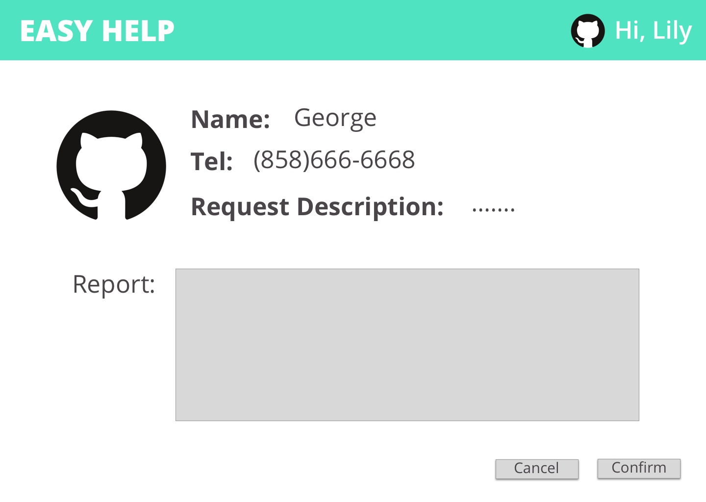

# COGS 121 Team ZZZZ milestone 1

## Team Members:
  Wei Zeng  
  Qianzi Li  
  Xinyi Jiao  
  Siyu Zhou

## Project Proposal:
  Hi, we are team "ZZZZ". This quarter, we are designing for the people with
  disabilities.
  Introducing our web-app "#TBD#", a platform for people with disabilities to seek help with daily matters.  
  How does "#TBD#" works? #TBD# is not only a platform to seek help, we are making it a platform to provide help as well. People with disabilities could submit a request to our platform while the volunteers could accept the tickets.

## Why #TBD# fits the project theme?
  The theme of the project is to design for people who are very different from ourselves. All of our team members are physically and mentally healthy. We believe that this is a meaningful and helpful platform that our target population **NEEDS**. Our app connects volunteers with people with disabilities who needs assistance via quick matching system based on our unique algorithm. From our friends experiences, there's always some moments that people with disabilities need helps from others. However, it isn't always easy to ask for help. "TBD" provides a fast, safe and convenient platform for people with disabilities to solve their needs.

## Possible API that we could use:
  We plan to use the Google Map API in order to access the location info and use the distance matrix API to calculate the distance between the requester and volunteers so that we can sort the tickets. Also we can mark the destination for the volunteers etc.

## Storyboards:
### Storyboard 1:
  
### Storyboard 2:
  
## Prototypes:
### Home Page:
#### At the Home Page, our users could either click on "Be a volunteer.." or "Get Helps.." to enter our two different sections of interfaces.  
  

### Prototype 1 (User Click on "Get Help"):  

#### Once the user fill in all the information and hit submit, our app will navigate to the progress page. If the user hit cancel, the app will simply return to the home page.  
  

#### At the progress page, user have a view of who is picking up the order. Users could click cancel to cancel the order navigating back to the home page or they could hit record to see all ongoing and past orders.  
  

#### At the record page, users could hit back to go back to the progress page.  
  

#### Once the order is complete, users could rate and comment the volunteer. If users hit cancel, no rate and comments will be documented, if they hit submit, info will be recorded.
  

### Prototype 2 (User Click on "Be a volunteer"):

#### Once the users enter the Request Board page, they will be able to see all requests submitted and filter by their preferences. If they find a match, simply click on the ticket to accept.  
    

#### After accepting a ticket, info about the requester will be displayed, including a map showing location, phone number and names. Users could click cancel to cancel the order navigating back to the home page or they could hit record to see all ongoing and past orders.     
    

#### At the record page, users could hit back to go back to the previous page.
    

#### 
  
