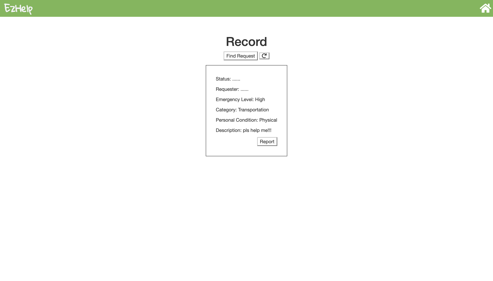

# COGS 121 Team ZZZZ milestone 2

## Team Members:
  Wei Zeng  
  Qianzi Li  
  Xinyi Jiao  
  Siyu Zhou

## Idea Follow-Up & Restatement  
Nothing changed. We will continue designing for the people with disabilities.
"Ezhelp" will be a platform where people in need could seek helps, and people
with passion and love could provide any kinds of help that people need.

## Early Development: UI Skeletons (April.27th ~ 30th)  

### Back-end:
  Server implemented with Express & Node.js. At this stage, the server loads htmls
from the static files directory with functionalities (1.) to get all users from
 the user table in our SQLite3 database, (2.) post function to write request
 information into the request_info table in the database and (3.) to get all
 request info from the database.

### Front-end:
  The front-end access the data from back-end via ajax calls and feed the infos
  back to the htmls.

#### Front-end UI Skeletons

##### Home Page (Users can always navigate back to home by clicking the home button at upper right and the logo):

    
  

##### Hit TRY IT NOW navigate to login page
    
  

##### If login as a volunteer, navigate to the volunteer sections of files  
    
  
  
  
  

##### If login as a requester, navigate to requester sections of files
  
  
  
  
  
  

### Comparing to original paper prototypes:
  Most functionalities are identical to our original design, the only differences at this stage would be the alignments and aesthetic part of the whole thing. In addition, we made some changes to how different files connect and navigate, designing loops within each section to enhance usability. Other than these, again, we are basically sticking close to our original ideas.
