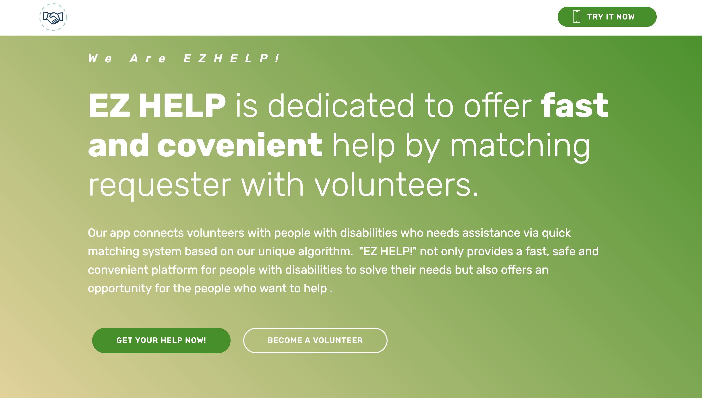
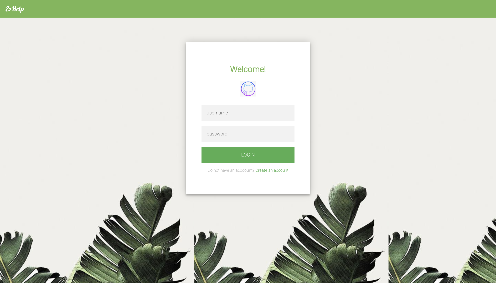

# COGS 121 Team ZZZZ milestone 3

## Team Members:
  Wei Zeng  
  Qianzi Li  
  Xinyi Jiao  
  Siyu Zhou

### UI comparing to previous milestone:
  Previously in m2, lots of our pages were only on a skeleton level, with only text and button to show functionalities. Till today, we have made the aesthetic clearer and nicer by adding css to div containers, bodies, and etc. In addition, we also added color and changed the size of many buttons in our app. Alignments and padding issues were also fixed in most pages.

#### Front-end UI Screenshots

##### Home Page (Users can always navigate back to home by clicking the home button at upper right and the logo):

    
  

##### Hit TRY IT NOW navigate to login page
    
  

##### If login as a volunteer, navigate to the volunteer sections of files  
    
  
  
  
  

##### If login as a requester, navigate to requester sections of files
  
  
  
  
  
  
