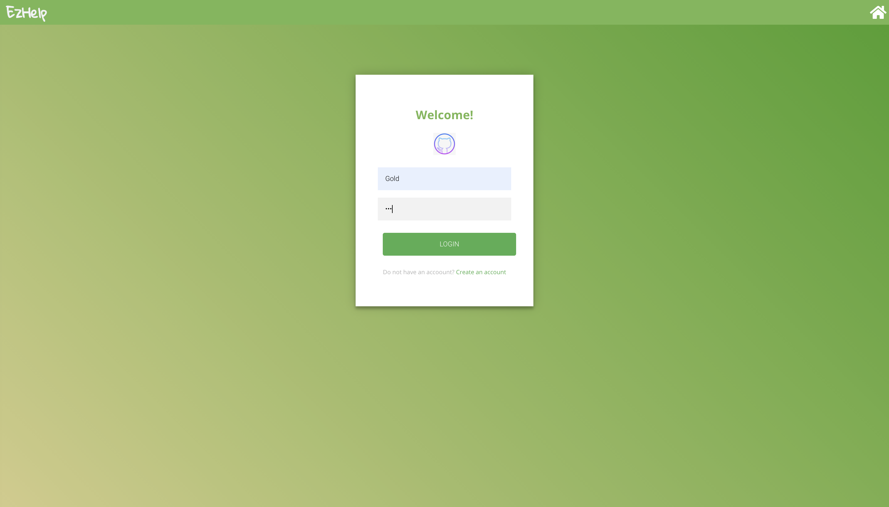
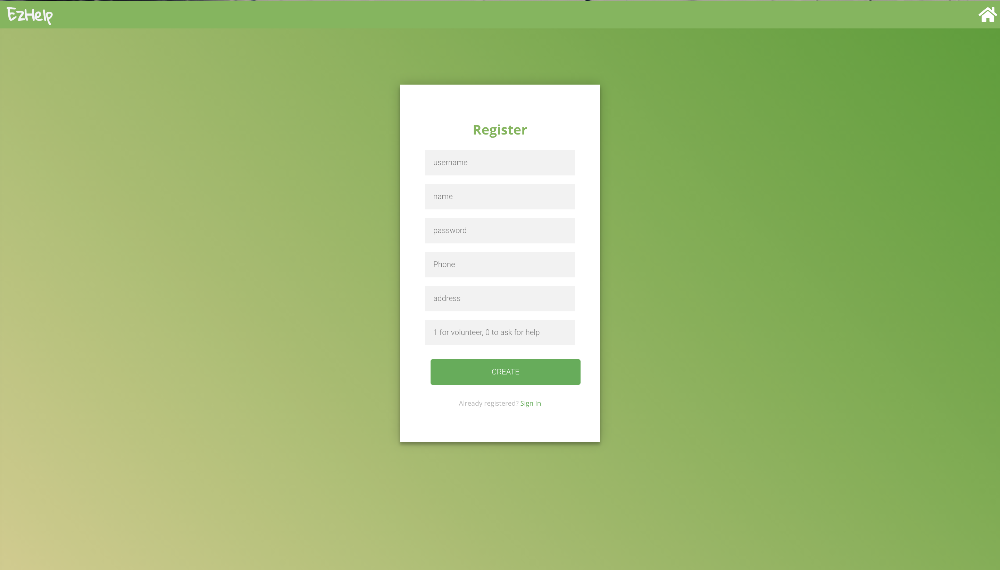
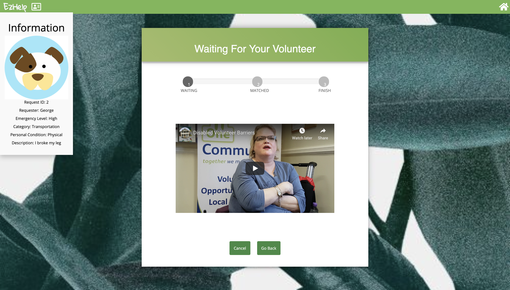
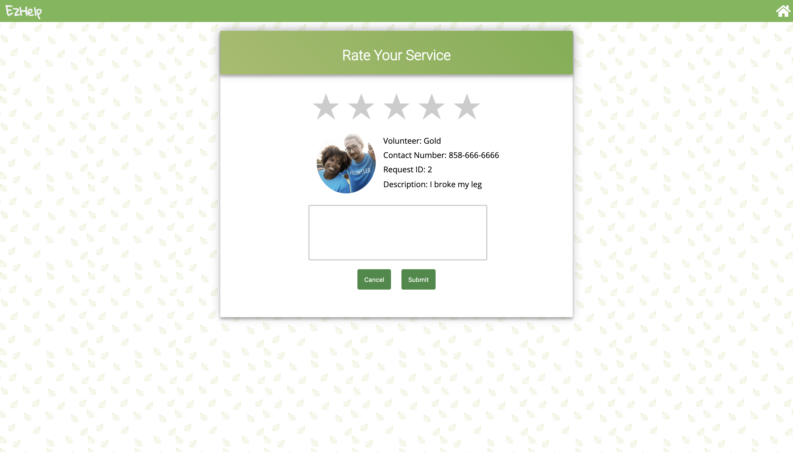

# COGS 121 Team ZZZZ milestone 4

## Team Members:
  Wei Zeng  
  Qianzi Li  
  Xinyi Jiao  
  Siyu Zhou

### IMPORTANT NOTE ABOUT USER ACTIONS
  Due to unknown glitches with using the navigator.geolocation function, the location may not always be accessible by the user. A known solution to the bug is to first go to the official bing map site and hit locate my current location button before doing any other interaction with our app. If the current location can be get on the official bing site, the location service will most likely work as well on our app.

### User Action 1:
  Login/register to the system as a requester via hitting the "try it now" button. User will be able to submit request and wait for a volunteer to accept the ticket, seeing where the volunteer will be coming from and get the estimated time that the volunteer will arrive. Finally finish the ticket and rate the volunteer.

### User Action 2:
  Login/register to the system as a volunteer via hitting the "try it now" button. User will be able to accept a request and get the location of the requester via the map being display(together with the estimated time info). Finally finish the ticket and rate the requester.

### UI comparing to previous milestone:
  Comparing to m3, we made a few changes to our UI designs including 1. Background of the rating pages, 2. a few Click buttons' position, 3. taskinfo page map padding and position relative to Background and buttons, 4. login page background, 5. Added profile drop-down upper left of the site right next to the ezhelp title.

#### Front-end UI Screenshots

##### Home Page (Users can always navigate back to home by clicking the home button at upper right and the logo):

    
  

##### Hit TRY IT NOW navigate to login page
    
  

##### If login as a volunteer, navigate to the volunteer sections of files  
    
  
  
  
  

##### If login as a requester, navigate to requester sections of files
  
  
  
  
  
  
