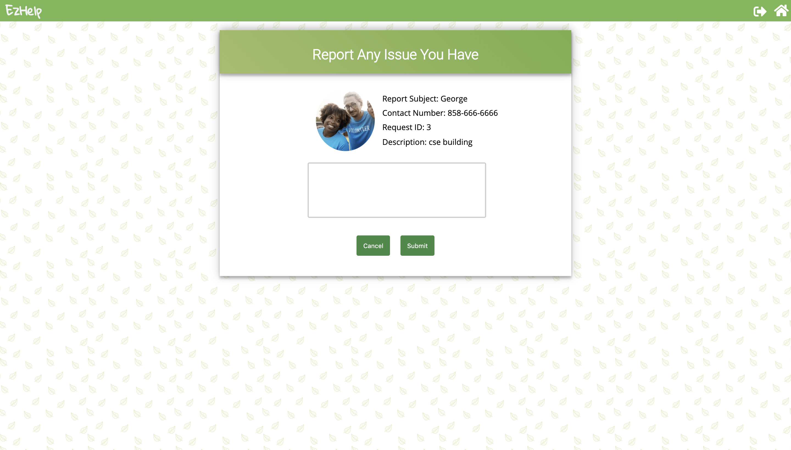

# COGS 121 Team ZZZZ milestone 5

## Team Members:
  Wei Zeng  
  Qianzi Li  
  Xinyi Jiao  
  Siyu Zhou

### How target population would use our app:
#### As a requester:
  People with disability could submit login to our app submitting a request, once a volunteer pick up the ticket, he/she will be notified with the acceptor's info and location. Finally requester can meet with the volunteer and get help with anything he/she requested.
### As a volunteer:
  Anyone who have passion helping others can login to our app as an volunteer. In the task center, volunteer can pick up tickets submitted by a requester, once the ticket is picked up, location of the request will be shown with other necessary infos. Finally the volunteer can meet up with the requester and help him/her out.

### Data display:
  By connecting to the bing map api, we display the route data via the bing map. Both the requester and the volunteer have access to each others location and estimated arrival time. Specific speaking, this is implemented via getting the current location of the requester and volunteer and create bing map waypoints. These waypoints then got pass in to the bing map api which later return us the route informations and display the route to the map.

  
  

<!-- (FIXME) -->
### UI comparing to previous milestone:
  Mostly the same except the logout button upper right to the window.
  Also changed the design of the filter to a dropdown select box.

<!-- (FIXME, MODIFY THE URL TO DISPLAY PICs) -->
#### Front-end UI Screenshots

##### Home Page (Users can always navigate back to home by clicking the home button at upper right and the logo):

    
  

##### Hit TRY IT NOW navigate to login page
    
  

##### If login as a volunteer, navigate to the volunteer sections of files  
    
  
  
  
  

##### If login as a requester, navigate to requester sections of files
  
  
  
  
  
  
